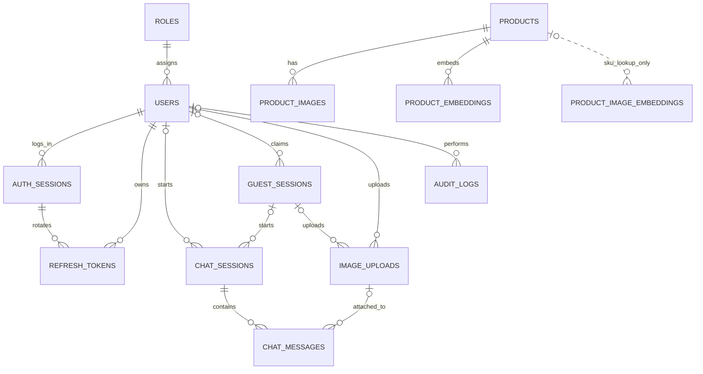
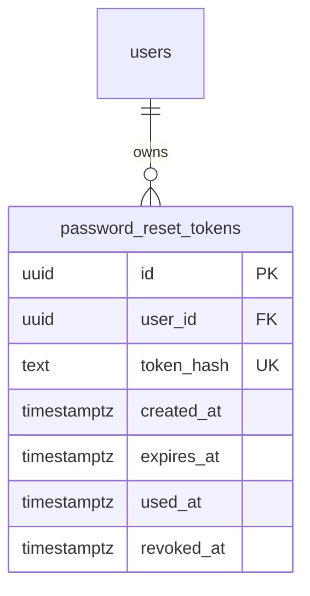

# Ink Buddy Database Schema

เอกสารนี้อธิบาย schema เริ่มต้นใน [`ddl/001_init.sql`](ddl/001_init.sql) สำหรับแชตบอตสินค้าเครื่องเขียน ผู้ใช้แนบได้เฉพาะรูปภาพ ไม่มีตารางหรือ API สำหรับอัปโหลดเอกสาร PDF/DOCX

## สถานะโครงสร้าง (2026-10-03)

DDL snapshot ปัจจุบันมี **14 ตาราง** รวม Guest sessions และ Image RAG แล้ว Auth/Guest ใช้งานจริงแล้ว ฐาน local ใน Podman apply migration 003–005 แล้วพร้อม backup ใน .local/backups; ฐานเครื่องอื่นต้องตรวจและ apply migration ตาม schema ที่มี

- ฐานใหม่: รัน `ddl/001_init.sql` ที่อัปเดตแล้วเพียงไฟล์เดียว
- ฐานเดิม: backup ก่อน แล้วรัน migration ตามลำดับด้านล่าง ไม่รัน init ซ้ำ
- ห้ามรัน migration Guest ซ้ำหรือรันหลัง fresh init; ตอนนี้ยังไม่มี migration tracking อัตโนมัติ

```shell
psql -X -v ON_ERROR_STOP=1 -d ink_buddy -f database/migrations/001_guest_sessions.sql
psql -X -v ON_ERROR_STOP=1 -d ink_buddy -f database/migrations/002_product_image_embeddings.sql
psql -X -v ON_ERROR_STOP=1 -d ink_buddy -f database/migrations/003_auth_sessions.sql
psql -X -v ON_ERROR_STOP=1 -d ink_buddy -f database/migrations/004_uuid_v7.sql
psql -X -v ON_ERROR_STOP=1 -d ink_buddy -f database/migrations/005_register_password_reset.sql
```

Migration 002 รองรับตาราง image embeddings ที่ SQLAlchemy เคยสร้างไว้ด้วย IF NOT EXISTS แต่ไม่ซ่อมตารางที่ schema ไม่ตรง ต้องตรวจโครงสร้างเดิมก่อน apply และตรวจว่า constraint `uq_product_chunk` มีอยู่สำหรับ repository UPSERT Migration อาจ lock ตาราง ควรรันช่วงไม่มีการเขียนข้อมูล

## วิธีเริ่มต้นฐานข้อมูล

### ใช้ Podman Compose บนเครื่อง (แนะนำสำหรับ development)

1. ติดตั้ง Podman และ Compose provider ที่ `podman compose` ใช้งานได้ บน Windows ให้เริ่ม Podman machine ก่อนด้วย `podman machine start` หากยังไม่เคยสร้าง machine ให้ `podman machine init` ก่อนหนึ่งครั้ง
2. เข้าโฟลเดอร์ `docker/` คัดลอก `.env.example` เป็น `.env` แล้วกรอก `POSTGRES_PASSWORD` ด้วยรหัสผ่านของคุณเอง อย่า commit `.env`
3. จากโฟลเดอร์ `docker/` รัน `podman compose up -d`
4. ตรวจสถานะด้วย `podman compose ps` และดู log ด้วย `podman compose logs postgres`

ค่าเริ่มต้น: database `ink_buddy`, user `ink_buddy`, port บนเครื่อง `5432`, เปิดให้เชื่อมต่อผ่าน `127.0.0.1` เท่านั้น หากพอร์ตนี้ถูกใช้อยู่ เปลี่ยน `POSTGRES_PORT` ใน `.env` ก่อนรัน Backend บนเครื่องเชื่อมด้วย `127.0.0.1:<POSTGRES_PORT>`; backend ที่รันเป็น service ใน Compose เดียวกันควรใช้ hostname `postgres` และ port `5432`

Compose ใน `docker/compose.yaml` ใช้ named volume `postgres_data` เพื่อเก็บข้อมูล การสั่ง `podman compose down` จะหยุดและลบ container แต่เก็บ named volume ไว้ **อย่าใช้ `down -v`** หากต้องการรักษาข้อมูล สคริปต์ `001_init.sql` ใน `/docker-entrypoint-initdb.d/` จะรัน **เฉพาะครั้งแรกที่ volume ยังว่าง** การแก้ SQL init หลังฐานข้อมูลถูกสร้างแล้วจะไม่ย้อนกลับไปปรับฐานข้อมูลเดิม; ใช้ migration สำหรับการเปลี่ยน schema

ไฟล์ SQL ถูก bind mount จาก repository บน Windows หาก Podman machine เข้าถึงไดรฟ์ของโปรเจคไม่ได้ ให้ตรวจการแชร์/mount path ของ machine ก่อน ไม่ควรแก้โดยลบ volume ที่มีข้อมูล

### รัน SQL โดยตรงกับ PostgreSQL ที่เตรียมไว้แล้ว

1. เตรียม PostgreSQL **13 ขึ้นไป** พร้อม extension `vector` และ `pg_trgm` ที่ติดตั้งบน server แล้ว
2. สร้างฐานข้อมูลเปล่าและบัญชีที่มีสิทธิ์สร้าง extension, table และ index ในฐานนั้น
3. รันจาก root ของ repository:

   ```bash
   psql -X -v ON_ERROR_STOP=1 -d ink_buddy -f database/ddl/001_init.sql
   ```

สคริปต์ใช้ transaction เดียว: ถ้าคำสั่งล้มเหลว schema ที่สร้างใน transaction จะ rollback สคริปต์นี้ออกแบบสำหรับฐานข้อมูลใหม่และ **ไม่ใช่ migration ที่รันซ้ำ** เมื่อมีข้อมูลแล้วให้สร้างไฟล์ migration ใหม่แทน การกำหนด `updated_at` ให้เปลี่ยนเมื่อแก้ข้อมูลเป็นหน้าที่ของแอปพลิเคชันหรือ migration เพิ่มเติม; schema นี้ตั้งค่า default เฉพาะตอน insert

`vector(1024)` ยึด dense embedding ของ BGE-M3 รุ่นที่เลือก หากเปลี่ยน embedding model หรือ dimension ต้องออกแบบ migration/re-embedding; ห้ามปะปนเวกเตอร์ต่างรุ่นในผลค้นโดยไม่กรอง `model_name`

## ความสัมพันธ์หลัก



ER แสดงความสัมพันธ์ SKU ของ image embeddings เป็นเชิงตรรกะ ไม่ใช่ FK จริง; owner ของแชต/รูปต้องเป็น User หรือ Guest หนึ่งอย่างเท่านั้น

## ตาราง

### `roles`

บทบาท `user` และ `admin` ถูกเพิ่มในสคริปต์เริ่มต้น `id` เป็น PK; `name` ไม่ซ้ำและห้ามว่าง ใช้กำหนดสิทธิ์ร่วมกับ `users.role_id`

### `users`

บัญชีผู้ใช้: `id` เป็น PK; `role_id` เป็น FK ไป `roles`; email, password hash, ชื่อแสดง, สถานะ และเวลา การตรวจรูปแบบ email และการ hash password ทำในแอป; ฐานข้อมูลบังคับเพียงค่าไม่ว่างและ email ที่ไม่ซ้ำแบบไม่แยกตัวพิมพ์ใหญ่เล็ก

### `refresh_tokens`

เก็บ **hash** ของ refresh token, ผู้ใช้, วันหมดอายุและเวลายกเลิก `user_id` เป็น FK; ลบตามผู้ใช้เมื่อมีการลบบัญชีจริง Unique `token_hash` ช่วย lookup/revoke โดยไม่เก็บ token ดิบ

### `chat_sessions`

แต่ละแชตมี owner, title, summary และ `summary_checkpoint` ซึ่งเป็น `sequence_number` สูงสุดที่รวมใน summary แล้ว `deleted_at` ใช้ soft delete เพื่อซ่อนแชตโดยไม่ทำลายทันที FK `user_id` ใช้ `RESTRICT` สำหรับการลบบัญชีจริง เพื่อบังคับให้มีขั้นตอนลบหรือเก็บข้อมูลอย่างชัดเจน

### `chat_messages`

ข้อความในแต่ละ session มีลำดับ `sequence_number` ที่ไม่ซ้ำภายใน session, role, content, product reference snapshot และ `image_id` ถ้ามีรูป FK ของ `image_id` ใช้ `RESTRICT` เมื่อจะลบภาพจริง เพื่อไม่ให้ข้อความแบบแนบรูปอย่างเดียวกลายเป็นข้อความว่าง ส่วนการ soft delete ภาพยังทำได้ ต้องตรวจว่า owner ของรูปตรงกับ owner ของ session ทั้งกรณี user_id และ guest_session_id ใน service เพราะ FK เดี่ยวไม่ได้รับประกันเงื่อนไขข้ามตารางนี้

### `products`

ข้อมูล catalog: SKU, ชื่อ, ประเภท, ยี่ห้อ, คำอธิบาย, คุณลักษณะ JSON, ราคา, สกุลเงิน, availability และ `source_ref` ฟิลด์ราคา/availability เป็น nullable เพื่อไม่สร้างข้อมูลที่แหล่งข้อมูลยังไม่มี `source_ref` ช่วยแสดงที่มาของคำตอบและตรวจสอบข้อมูลสินค้า

### `product_images`

รูปภาพอ้างอิงใน catalog ผูกกับ product หนึ่งตัว มีรูปหลักได้สูงสุดหนึ่งรูปต่อสินค้า การลบสินค้าแบบ hard delete จะลบแถวรูปและ embedding ตาม FK แต่ไฟล์จริงใน storage ต้องมีขั้นตอน cleanup แยก

### `product_embeddings`

เก็บข้อความ normalized ที่ใช้สร้าง embedding (`source_text`), ชื่อโมเดล และเวกเตอร์ BGE-M3 `vector(1024)` หนึ่งสินค้าและหนึ่งโมเดลมี embedding ได้หนึ่งรายการ ถ้ารายละเอียดสินค้าเปลี่ยนต้องสร้าง embedding ใหม่ก่อนใช้ค้น ผลค้นแบบ cosine ต้องกรองโมเดลที่ตรงกับ query embedding เสมอ

### `image_uploads`

รูปที่ผู้ใช้แนบ มี owner, private `storage_key`, MIME, ขนาด, สถานะ, OCR text และผลวิเคราะห์ภาพ JSON `deleted_at` ใช้ soft delete ตัวไฟล์จริงอยู่ใน private storage ไม่อยู่ใน PostgreSQL แอปต้องตรวจ ownership ก่อนอ่าน วิเคราะห์ หรือใช้รูปในแชต

### `audit_logs`

เก็บ actor, action, resource และ metadata ที่ไม่เป็นความลับ `actor_user_id` เป็น nullable สำหรับเหตุการณ์ระบบ ถ้าลบบัญชีจริงจะตั้ง actor เป็น null เพื่อคง audit trail; retention ของ log ต้องกำหนดก่อน production

## Index และเหตุผล

| Index/Constraint | ตาราง | เหตุผล |
|---|---|
| PK ทุกตาราง | ทุกตาราง | lookup ตาม UUID และ FK target |
| `roles.name` unique | `roles` | lookup บทบาทและป้องกันชื่อซ้ำ |
| `users_email_lower_uq` | `users` | login/unique email แบบ case insensitive |
| `users_role_id_idx` | `users` | ค้นสมาชิกตาม role |
| `refresh_tokens.token_hash` unique | `refresh_tokens` | lookup/revoke token |
| `refresh_tokens_user_expires_idx` | `refresh_tokens` | ดู/ยกเลิก token ของผู้ใช้ |
| `refresh_tokens_expires_idx` | `refresh_tokens` | ล้าง token หมดอายุ |
| `chat_sessions_owner_recent_idx` | `chat_sessions` | ประวัติแชตล่าสุดต่อผู้ใช้; partial index ข้าม soft-deleted |
| `(session_id, sequence_number)` unique | `chat_messages` | รักษาลำดับและอ่านประวัติใน session; ไม่เพิ่ม index ซ้ำ |
| `chat_messages_image_id_idx` | `chat_messages` | ตรวจข้อความที่อ้างภาพก่อนลบจริง |
| `products_sku_uq` | `products` | SKU ไม่ซ้ำเมื่อมีค่า |
| `products_name_trgm_idx` | `products` | ค้นชื่อบางส่วน/สะกดใกล้เคียงด้วย `pg_trgm` |
| `products_category_brand_idx` | `products` | กรองประเภท หรือประเภท+ยี่ห้อ |
| `products_brand_idx` | `products` | กรองยี่ห้อโดยไม่มีประเภท |
| `product_images_product_id_idx` | `product_images` | โหลดรูปสินค้า |
| `product_images_one_primary_uq` | `product_images` | มีภาพหลักสูงสุดหนึ่งภาพต่อสินค้า |
| `(product_id, model_name)` unique | `product_embeddings` | ไม่เก็บ embedding รุ่นเดียวกันซ้ำสำหรับสินค้า |
| `product_embeddings_cosine_hnsw_idx` | `product_embeddings` | ค้นเวกเตอร์ cosine แบบ approximate nearest neighbor |
| `image_uploads_owner_recent_idx` | `image_uploads` | รูปล่าสุดของผู้ใช้; partial index ข้าม soft-deleted |
| `audit_logs_actor_recent_idx`, `audit_logs_action_recent_idx` | `audit_logs` | ตรวจเหตุการณ์ตาม actor/action และเวลา |

**ข้อจำกัดด้าน performance:** HNSW ใช้หน่วยความจำและเวลาในการ build มากกว่า B-tree; สำหรับ catalog เล็ก exact search อาจเร็วพออยู่แล้ว ควรใช้ `EXPLAIN (ANALYZE, BUFFERS)` และวัด recall/latency กับข้อมูลจริงก่อนปรับค่า HNSW หรือเพิ่มดัชนีอื่น `pg_trgm` ช่วยค้นชื่อบางส่วน แต่คุณภาพค้นภาษาไทยต้องทดสอบกับชื่อสินค้าจริง การกรอง `attributes` JSON ยังไม่มี GIN index เพราะยังไม่ทราบรูปแบบ filter ที่ใช้จริง

## Data integrity และนโยบายการลบ

- `CHECK` จำกัดราคาไม่ติดลบ, ขนาดภาพมากกว่าศูนย์, รูปแบบข้อมูล JSON และค่าของ role/status ที่กำหนด
- การลบ session/product แบบ hard delete จะ cascade ไปยัง messages หรือ product images/embeddings ตาม FK; endpoint ผู้ใช้ควรใช้ soft delete ของ session ก่อน
- การลบ user/image แบบ hard delete อาจติด `RESTRICT` หากยังมีข้อมูลเกี่ยวข้อง จึงต้องมีขั้นตอนลบและ cleanup ที่ชัดเจน
- ฐานข้อมูลไม่ตรวจว่า `chat_messages.image_id` เป็นรูปของเจ้าของ session; service ต้องตรวจ
- ไฟล์ภาพจริงอยู่นอกฐานข้อมูล จึงต้องจัดการ cleanup เมื่อ hard delete แถวที่เกี่ยวข้อง

## การค้นสินค้าและภาพ

1. ใช้ SQL filters กับ SKU, ประเภท, ยี่ห้อ และราคาเมื่อผู้ใช้ระบุเงื่อนไขชัดเจน
2. ใช้ trigram index กับชื่อสินค้า และ vector cosine กับคำถามที่อธิบายความต้องการ
3. Image RAG ปัจจุบันใช้ Qwen3-VL-Embedding-2B/vector(2048) และ Qwen3-VL ผ่าน Ollama เมื่อจำเป็นต้องวิเคราะห์ภาพ; metadata API อ่านจาก products โดย lookup SKU
4. BGE-M3/vector(1024) เป็น **text embedding** แยกตารางจาก image embedding ไม่สามารถปะปน vector spaces ได้

## เรื่องที่ยังต้องกำหนด

- แหล่งข้อมูล catalog และกระบวนการ import/sync
- นโยบายความสดของราคาและ availability
- เกณฑ์ exact match เทียบกับ similar match จากภาพ
- อายุการเก็บ chat, uploaded images, audit logs และวิธีลบข้อมูลจริง
- การแยกสิทธิ์ admin สำหรับแก้ catalog; init นี้สร้างเพียง role และตาราง ไม่สร้าง admin account

## Guest sessions และนโยบายโควตา

`guest_sessions` เป็นตัวตนชั่วคราวที่ server ออกให้ ไม่ใช่ chat thread: ภายในหนึ่ง Guest session มีหลายแชตได้ เป็นนโยบายที่ตกลงแล้ว เก็บ token hash เท่านั้น และ expires_at=เวลาสร้าง+24ชั่วโมง ไม่ต่ออายุ

`chat_sessions` และ `image_uploads` ใช้ nullable user_id/guest_session_id พร้อม CHECK XOR บังคับมีเจ้าของหนึ่งอย่าง FK Guest ใช้ RESTRICT ข้อมูลผู้ใช้เดิมไม่ต้อง backfill

โควตา 3 รูปใช้ `image_upload_limit=3` และ counter 0–3 ข้อเสนอการนับคือรับสำเร็จจึงนับ ลบรูปไม่คืนโควตา ค้นรูปเดิมไม่เสียเพิ่ม **CHECK ไม่ได้นับแถว image_uploads ให้อัตโนมัติ** API ต้อง lock แถว Guest ด้วย SELECT FOR UPDATE และ update counter/insert รูปใน transaction เดียว ตรวจ expiry/revoked/claimed ด้วย หาก DB fail rollback และ cleanup ไฟล์ implementation Auth ใช้ Guest principal และ quota transaction นี้แล้ว

Claim ต้องย้าย owner ของแชตและรูปเป็น user ใน transaction เดียว พร้อมตั้ง claimed user/time และ revoke token หากมี claim ต้องมี revoked_at ตาม CHECK; DB ไม่ย้าย owner ให้อัตโนมัติ; Auth service ทำ transaction นี้แล้ว

Guest expiry และ image soft delete ไม่ลบไฟล์จริง ต้องมี cleanup worker: ลบข้อความ/แชตที่เกี่ยวข้องก่อนลบรูปและ Guest rows พร้อมลบ private storage ไม่มีการ cascade ที่ซ่อนขั้นตอนนี้

### Index เพิ่มเติม

| Index | เหตุผล |
|---|---|
| guest_sessions.token_hash UNIQUE | lookup credential hash |
| guest_sessions_expires_idx | หา session หมดอายุเพื่อ cleanup |
| guest_sessions_claimed_user_idx | หา Guest ที่เคยย้ายเข้าบัญชี |
| chat_sessions_guest_recent_idx | อ่านแชต Guest ล่าสุดที่ยังไม่ soft delete |
| image_uploads_guest_recent_idx | อ่านรูป Guest ล่าสุดที่ยังไม่ soft delete |
| chat_sessions_guest_fk_idx / image_uploads_guest_fk_idx | lookup ข้อมูลทั้งหมดรวม soft-deleted ตอน claim/cleanup และตรวจ FK; recent partial indexes ไม่ครอบคลุมแถวที่ลบแล้ว |

## Product image embeddings

ตรงกับ `backend/app/models/product.py`: integer identity ผ่าน serial, UNIQUE (sku, chunk_type, variant) ชื่อ `uq_product_chunk` เพื่อให้ repository UPSERT ได้ มี image/image_aug/caption และ vector 2048 มิติ metadata JSONB เป็น snapshot จาก catalog

ไม่มี FK จาก SKU ไป products ตาม model ปัจจุบัน index ได้ก่อน seed products แต่ API ตัดผลที่ไม่มี SKU ใน products จึงต้อง sync ทั้งสองส่วน ความยาว SKU ของ index คือ 64 ส่วน products คือ 100 ตาม model; catalog ต้องใช้ SKU ไม่เกิน 64 จนกว่าจะปรับทั้ง model/DDL

Indexes SKU และ GIN metadata เก็บตาม model ปัจจุบัน; GIN ต้องวัดกับ JSON filter จริง ไม่รับประกันว่า expression is_active ใน repository จะใช้ index นี้ UNIQUE chunk key เก็บโมเดลหนึ่งชุดต่อ chunk การเปลี่ยนโมเดล overwrite ชุดเดิม ต้อง reindex ให้ครบและไม่ค้นระหว่างชุดปะปน

ไม่เพิ่ม HNSW vector(2048) เพราะเกินขีดจำกัด 2000 มิติของ vector index ใช้ exact scan สำหรับ catalog เล็กก่อน หากโตให้ประเมิน halfvec expression index และปรับ query ให้ตรงกับ expression อย่าสร้าง HNSW ที่ใช้ไม่ได้

## Auth sessions และ Refresh rotation

auth_sessions เก็บ Login session อายุสูงสุด7วัน มี revocation ที่ตรวจทุก User API request เพื่อให้ Logout มีผลทันที JWT มี sid อ้าง session และ sub อ้าง user; role/active อ่านจาก DB ไม่เชื่อ role จาก JWT ที่อาจเก่า

refresh_tokens เพิ่ม session_id, rotated_at และ replaced_by_id: rotate token ใหม่ใน parent session เดิมโดยไม่ต่ออายุ revoke ตัวเก่า และตรวจ reuse หาก token ที่ rotate แล้วถูกใช้อีกให้ revoke session และ tokens ทั้งชุด การ lock parent ก่อน token ทำให้ concurrent refresh/logout serialize

Migration003 revoke refresh tokens เดิมที่ไม่มี session โดยไม่ลบบัญชีหรือข้อมูลแชต session_id nullable เฉพาะ legacy rows ที่ revoked แล้ว CHECK บังคับ active token ต้องมี session; composite FK (session_id,user_id) ป้องกัน token อ้าง session ของคนอื่น

Indexes: auth_sessions_user_idx สำหรับ lookup session ต่อ user, auth_sessions_expires_idx สำหรับ expiry, refresh_tokens_session_idx สำหรับ revokeทั้งชุด และ refresh_tokens_replaced_idx สำหรับ relation/cleanup; PK auth_sessions ใช้ตรวจ access sid ทุกคำขอ

Guest หมดอายุ24ชั่วโมง ข้อมูลที่ยังไม่ claim cleanup ได้หลังหมดอายุอีก24ชั่วโมง ใช้ python -m scripts.cleanup_guests (dry-run) และ --apply ที่ backend ต้องตั้ง scheduler เอง

## Column reference ตาม DDL ปัจจุบัน

Types/nullability จาก SQL init; constraints/defaults/FKs ดู SQL และคำอธิบายด้านบน

### `roles` — Columns

| Column Name | Data Type | Nullable | Description |
|---|---|---|---|
| id | uuid | No | Primary key |
| name | varchar(50) | No | name |
| description | text | Yes | description |

### `users` — Columns

| Column Name | Data Type | Nullable | Description |
|---|---|---|---|
| id | uuid | No | Primary key |
| role_id | uuid | No | FK roles |
| email | varchar(320) | No | email |
| password_hash | text | No | Argon2id; bcrypt เดิม migrate หลัง Login |
| display_name | varchar(120) | Yes | display name |
| is_active | boolean | No | is active |
| created_at | timestamptz | No | เวลาสร้าง |
| updated_at | timestamptz | No | แอปอัปเดตเมื่อแก้ข้อมูล |

### `auth_sessions` — Columns

| Column Name | Data Type | Nullable | Description |
|---|---|---|---|
| id | uuid | No | Primary key |
| user_id | uuid | No | FK users; nullable เฉพาะ owner ของแชต/รูป |
| created_at | timestamptz | No | เวลาสร้าง |
| expires_at | timestamptz | No | เวลาหมดอายุ |
| revoked_at | timestamptz | Yes | เวลายกเลิกสิทธิ์ |

### `refresh_tokens` — Columns

| Column Name | Data Type | Nullable | Description |
|---|---|---|---|
| id | uuid | No | Primary key |
| user_id | uuid | No | FK users; nullable เฉพาะ owner ของแชต/รูป |
| session_id | uuid | Yes | FK auth_sessions สำหรับ refresh; FK chat_sessions สำหรับ messages |
| rotated_at | timestamptz | Yes | เวลาที่ token ถูกใช้และหมุนตัวใหม่ |
| replaced_by_id | uuid | Yes | FK refresh_tokens ตัวใหม่ |
| token_hash | text | No | Hash เท่านั้น ไม่เก็บ token ดิบ |
| expires_at | timestamptz | No | เวลาหมดอายุ |
| revoked_at | timestamptz | Yes | เวลายกเลิกสิทธิ์ |
| created_at | timestamptz | No | เวลาสร้าง |

### `guest_sessions` — Columns

| Column Name | Data Type | Nullable | Description |
|---|---|---|---|
| id | uuid | No | Primary key |
| token_hash | text | No | Hash เท่านั้น ไม่เก็บ token ดิบ |
| image_upload_limit | smallint | No | คงที่3สำหรับGuest |
| image_uploads_used | smallint | No | จำนวนอัปโหลดสำเร็จ 0–3 |
| created_at | timestamptz | No | เวลาสร้าง |
| expires_at | timestamptz | No | เวลาหมดอายุ |
| revoked_at | timestamptz | Yes | เวลายกเลิกสิทธิ์ |
| claimed_by_user_id | uuid | Yes | FK users บัญชีที่รับ Guest |
| claimed_at | timestamptz | Yes | เวลา claim สำเร็จ |

### `chat_sessions` — Columns

| Column Name | Data Type | Nullable | Description |
|---|---|---|---|
| id | uuid | No | Primary key |
| user_id | uuid | Yes | FK users; nullable เฉพาะ owner ของแชต/รูป |
| guest_session_id | uuid | Yes | FK guest_sessions; owner XOR กับ user_id |
| title | varchar(200) | Yes | title |
| summary | text | Yes | summary |
| summary_checkpoint | integer | No | summary checkpoint |
| created_at | timestamptz | No | เวลาสร้าง |
| updated_at | timestamptz | No | แอปอัปเดตเมื่อแก้ข้อมูล |
| deleted_at | timestamptz | Yes | soft delete |

### `image_uploads` — Columns

| Column Name | Data Type | Nullable | Description |
|---|---|---|---|
| id | uuid | No | Primary key |
| user_id | uuid | Yes | FK users; nullable เฉพาะ owner ของแชต/รูป |
| guest_session_id | uuid | Yes | FK guest_sessions; owner XOR กับ user_id |
| storage_key | text | No | Private file key ไม่ใช่ไฟล์binary |
| mime_type | varchar(100) | No | mime type |
| size_bytes | bigint | No | size bytes |
| status | varchar(20) | No | status |
| ocr_text | text | Yes | ocr text |
| analysis | jsonb | Yes | analysis |
| created_at | timestamptz | No | เวลาสร้าง |
| deleted_at | timestamptz | Yes | soft delete |

### `chat_messages` — Columns

| Column Name | Data Type | Nullable | Description |
|---|---|---|---|
| id | uuid | No | Primary key |
| session_id | uuid | No | FK auth_sessions สำหรับ refresh; FK chat_sessions สำหรับ messages |
| sequence_number | integer | No | sequence number |
| role | varchar(20) | No | role |
| content | text | No | content |
| product_refs | jsonb | Yes | product refs |
| image_id | uuid | Yes | FK image_uploads |
| model_name | varchar(100) | Yes | model name |
| created_at | timestamptz | No | เวลาสร้าง |

### `products` — Columns

| Column Name | Data Type | Nullable | Description |
|---|---|---|---|
| id | uuid | No | Primary key |
| sku | varchar(100) | Yes | SKU สำหรับเชื่อมข้อมูลสินค้า |
| name | text | No | name |
| category | varchar(100) | Yes | category |
| brand | varchar(100) | Yes | brand |
| description | text | Yes | description |
| attributes | jsonb | No | attributes |
| price | numeric(12, 2) | Yes | price |
| currency | char(3) | Yes | currency |
| availability | varchar(30) | Yes | availability |
| source_ref | text | Yes | source ref |
| created_at | timestamptz | No | เวลาสร้าง |
| updated_at | timestamptz | No | แอปอัปเดตเมื่อแก้ข้อมูล |

### `product_images` — Columns

| Column Name | Data Type | Nullable | Description |
|---|---|---|---|
| id | uuid | No | Primary key |
| product_id | uuid | No | FK products |
| storage_key | text | No | Private file key ไม่ใช่ไฟล์binary |
| is_primary | boolean | No | is primary |
| alt_text | text | Yes | alt text |

### `product_embeddings` — Columns

| Column Name | Data Type | Nullable | Description |
|---|---|---|---|
| id | uuid | No | Primary key |
| product_id | uuid | No | FK products |
| model_name | varchar(100) | No | model name |
| source_text | text | No | source text |
| embedding | vector(1024) | No | Vector ตาม dimension ของตาราง |
| created_at | timestamptz | No | เวลาสร้าง |

### `product_image_embeddings` — Columns

| Column Name | Data Type | Nullable | Description |
|---|---|---|---|
| id | serial | No | Primary key |
| sku | varchar(64) | No | SKU สำหรับเชื่อมข้อมูลสินค้า |
| chunk_type | varchar(16) | No | chunk type |
| variant | smallint | No | variant |
| content | text | No | content |
| content_hash | varchar(64) | No | content hash |
| embedding | vector(2048) | No | Vector ตาม dimension ของตาราง |
| embed_model | varchar(128) | No | embed model |
| metadata | jsonb | No | JSON ข้อมูลประกอบ |
| updated_at | timestamptz | No | แอปอัปเดตเมื่อแก้ข้อมูล |

### `audit_logs` — Columns

| Column Name | Data Type | Nullable | Description |
|---|---|---|---|
| id | uuid | No | Primary key |
| actor_user_id | uuid | Yes | FK users; nullable สำหรับระบบ |
| action | varchar(100) | No | action |
| resource_type | varchar(50) | Yes | resource type |
| resource_id | uuid | Yes | resource id |
| metadata | jsonb | No | JSON ข้อมูลประกอบ |
| created_at | timestamptz | No | เวลาสร้าง |

## ข้อจำกัดนอก schema

ตรวจ 2026-10-03: transaction ของ Auth/Guest ทดสอบบน PostgreSQL แล้ว แต่ไฟล์ใน private storage ไม่ได้เป็น transaction เดียวกับ DB ดู [Auth review](../docs/api/auth/AUTH_REVIEW.md) สำหรับ partial file write และ cleanup retry behavior


## UUIDv7 (2026-10-03)

ID ใหม่ที่เป็น UUID ใช้ UUIDv7: database defaults เรียก `public.ink_buddy_uuid_v7()` และ Python ใช้ `app.core.identifiers.uuid7()` ชนิด column/API ยังคง UUID เพื่อรองรับ ID เดิม ไม่มีการเปลี่ยน primary/foreign keys ที่มีอยู่ ฐานเดิมต้อง apply `database/migrations/004_uuid_v7.sql` หลัง 003; ฐานใหม่ใช้ init ปัจจุบัน migrations 001–003 เก็บเป็นประวัติเดิม

UUIDv7 มี Unix timestamp ระดับ millisecond และ random bits ตาม [RFC 9562](https://www.rfc-editor.org/rfc/rfc9562.html#section-5.7) ไม่รับประกันลำดับภายใน millisecond หรือเมื่อ clock ย้อนกลับ ไม่ใช้ ID เป็น credential และยังตรวจ ownership ตามเดิม PostgreSQL 16 ใช้ compatibility function เพราะ built-in generator เป็น UUIDv4; ไม่มีการเปลี่ยนคอลัมน์ integer เช่น product_image_embeddings.id


## Chat Session behavior — 2026-10-04

API จัดการแชตใช้ schema/indexes เดิม ไม่มี migration ใหม่ Session service กำหนด title เริ่มต้น “แชตใหม่” และ soft delete ผ่าน deleted_at; เก็บข้อความ/รูปไว้ Message history ใช้ unique(session_id,sequence_number) index สำหรับ pagination Guest-before-chat locking ป้องกัน claim แข่งกับ mutations ส่วนการส่งข้อความยังไม่ implement

## password_reset_tokens — 2026-10-04

เก็บ credential สำหรับ reset password เฉพาะ hash; UUIDv7 ID ใหม่ Migration 005 เพิ่มตาราง/indices โดยไม่เปลี่ยนบัญชีหรือแชต ฐาน local apply แล้วหลัง backup

| Column Name | Data Type | Nullable | Description |
|---|---|---|---|
| id | uuid | No | PK default ink_buddy_uuid_v7() |
| user_id | uuid | No | FK users(id), ON DELETE CASCADE |
| token_hash | text | No | UNIQUE SHA-256 ของ opaque token |
| created_at | timestamptz | No | เวลาสร้าง default clock_timestamp() |
| expires_at | timestamptz | No | อายุเริ่มต้น 15 นาที ต้องมากกว่า created_at |
| used_at | timestamptz | Yes | เวลาที่ใช้สำเร็จ |
| revoked_at | timestamptz | Yes | เวลายกเลิก |

Relationship users 1:N password_reset_tokens. Unique token_hash ใช้ lookup credential; password_reset_user_recent_idx(user_id,created_at DESC) ใช้ cooldown/revoke; password_reset_expires_idx(expires_at) เตรียมค้นข้อมูลหมดอายุ ไม่มี vector ในตารางนี้ ไม่ลบ token rows อัตโนมัติในรอบนี้


