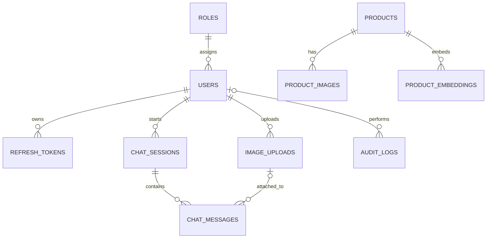

# Ink Buddy Database Schema

เอกสารนี้อธิบาย schema เริ่มต้นใน [`ddl/001_init.sql`](ddl/001_init.sql) สำหรับแชตบอตสินค้าเครื่องเขียน ผู้ใช้แนบได้เฉพาะรูปภาพ ไม่มีตารางหรือ API สำหรับอัปโหลดเอกสาร PDF/DOCX

## วิธีเริ่มต้นฐานข้อมูล

1. เตรียม PostgreSQL **13 ขึ้นไป** พร้อม extension `vector` และ `pg_trgm` ที่ติดตั้งบน server แล้ว
2. สร้างฐานข้อมูลเปล่าและบัญชีที่มีสิทธิ์สร้าง extension, table และ index ในฐานนั้น
3. รันจาก root ของ repository:

   ```bash
   psql -X -v ON_ERROR_STOP=1 -d ink_buddy -f database/ddl/001_init.sql
   ```

สคริปต์ใช้ transaction เดียว: ถ้าคำสั่งล้มเหลว schema ที่สร้างใน transaction จะ rollback สคริปต์นี้ออกแบบสำหรับฐานข้อมูลใหม่และ **ไม่ใช่ migration ที่รันซ้ำ** เมื่อมีข้อมูลแล้วให้สร้างไฟล์ migration ใหม่แทน การกำหนด `updated_at` ให้เปลี่ยนเมื่อแก้ข้อมูลเป็นหน้าที่ของแอปพลิเคชันหรือ migration เพิ่มเติม; schema นี้ตั้งค่า default เฉพาะตอน insert

`vector(1024)` ยึด dense embedding ของ BGE-M3 รุ่นที่เลือก หากเปลี่ยน embedding model หรือ dimension ต้องออกแบบ migration/re-embedding; ห้ามปะปนเวกเตอร์ต่างรุ่นในผลค้นโดยไม่กรอง `model_name`

## ความสัมพันธ์หลัก



## ตาราง

### `roles`

บทบาท `user` และ `admin` ถูกเพิ่มในสคริปต์เริ่มต้น `id` เป็น PK; `name` ไม่ซ้ำและห้ามว่าง ใช้กำหนดสิทธิ์ร่วมกับ `users.role_id`

### `users`

บัญชีผู้ใช้: `id` เป็น PK; `role_id` เป็น FK ไป `roles`; email, password hash, ชื่อแสดง, สถานะ และเวลา การตรวจรูปแบบ email และการ hash password ทำในแอป; ฐานข้อมูลบังคับเพียงค่าไม่ว่างและ email ที่ไม่ซ้ำแบบไม่แยกตัวพิมพ์ใหญ่เล็ก

### `refresh_tokens`

เก็บ **hash** ของ refresh token, ผู้ใช้, วันหมดอายุและเวลายกเลิก `user_id` เป็น FK; ลบตามผู้ใช้เมื่อมีการลบบัญชีจริง Unique `token_hash` ช่วย lookup/revoke โดยไม่เก็บ token ดิบ

### `chat_sessions`

แต่ละแชตมี owner, title, summary และ `summary_checkpoint` ซึ่งเป็น `sequence_number` สูงสุดที่รวมใน summary แล้ว `deleted_at` ใช้ soft delete เพื่อซ่อนแชตโดยไม่ทำลายทันที FK `user_id` ใช้ `RESTRICT` สำหรับการลบบัญชีจริง เพื่อบังคับให้มีขั้นตอนลบหรือเก็บข้อมูลอย่างชัดเจน

### `chat_messages`

ข้อความในแต่ละ session มีลำดับ `sequence_number` ที่ไม่ซ้ำภายใน session, role, content, product reference snapshot และ `image_id` ถ้ามีรูป FK ของ `image_id` ใช้ `RESTRICT` เมื่อจะลบภาพจริง เพื่อไม่ให้ข้อความแบบแนบรูปอย่างเดียวกลายเป็นข้อความว่าง ส่วนการ soft delete ภาพยังทำได้ ต้องตรวจว่า `image_uploads.user_id` ตรงกับ owner ของ session ใน service เพราะ FK เดี่ยวไม่ได้รับประกันเงื่อนไขข้ามตารางนี้

### `products`

ข้อมูล catalog: SKU, ชื่อ, ประเภท, ยี่ห้อ, คำอธิบาย, คุณลักษณะ JSON, ราคา, สกุลเงิน, availability และ `source_ref` ฟิลด์ราคา/availability เป็น nullable เพื่อไม่สร้างข้อมูลที่แหล่งข้อมูลยังไม่มี `source_ref` ช่วยแสดงที่มาของคำตอบและตรวจสอบข้อมูลสินค้า

### `product_images`

รูปภาพอ้างอิงใน catalog ผูกกับ product หนึ่งตัว มีรูปหลักได้สูงสุดหนึ่งรูปต่อสินค้า การลบสินค้าแบบ hard delete จะลบแถวรูปและ embedding ตาม FK แต่ไฟล์จริงใน storage ต้องมีขั้นตอน cleanup แยก

### `product_embeddings`

เก็บข้อความ normalized ที่ใช้สร้าง embedding (`source_text`), ชื่อโมเดล และเวกเตอร์ BGE-M3 `vector(1024)` หนึ่งสินค้าและหนึ่งโมเดลมี embedding ได้หนึ่งรายการ ถ้ารายละเอียดสินค้าเปลี่ยนต้องสร้าง embedding ใหม่ก่อนใช้ค้น ผลค้นแบบ cosine ต้องกรองโมเดลที่ตรงกับ query embedding เสมอ

### `image_uploads`

รูปที่ผู้ใช้แนบ มี owner, private `storage_key`, MIME, ขนาด, สถานะ, OCR text และผลวิเคราะห์ภาพ JSON `deleted_at` ใช้ soft delete ตัวไฟล์จริงอยู่ใน private storage ไม่อยู่ใน PostgreSQL แอปต้องตรวจ ownership ก่อนอ่าน วิเคราะห์ หรือใช้รูปในแชต

### `audit_logs`

เก็บ actor, action, resource และ metadata ที่ไม่เป็นความลับ `actor_user_id` เป็น nullable สำหรับเหตุการณ์ระบบ ถ้าลบบัญชีจริงจะตั้ง actor เป็น null เพื่อคง audit trail; retention ของ log ต้องกำหนดก่อน production

## Index และเหตุผล

| Index/Constraint | ตาราง | เหตุผล |
|---|---|
| PK ทุกตาราง | ทุกตาราง | lookup ตาม UUID และ FK target |
| `roles.name` unique | `roles` | lookup บทบาทและป้องกันชื่อซ้ำ |
| `users_email_lower_uq` | `users` | login/unique email แบบ case insensitive |
| `users_role_id_idx` | `users` | ค้นสมาชิกตาม role |
| `refresh_tokens.token_hash` unique | `refresh_tokens` | lookup/revoke token |
| `refresh_tokens_user_expires_idx` | `refresh_tokens` | ดู/ยกเลิก token ของผู้ใช้ |
| `refresh_tokens_expires_idx` | `refresh_tokens` | ล้าง token หมดอายุ |
| `chat_sessions_owner_recent_idx` | `chat_sessions` | ประวัติแชตล่าสุดต่อผู้ใช้; partial index ข้าม soft-deleted |
| `(session_id, sequence_number)` unique | `chat_messages` | รักษาลำดับและอ่านประวัติใน session; ไม่เพิ่ม index ซ้ำ |
| `chat_messages_image_id_idx` | `chat_messages` | ตรวจข้อความที่อ้างภาพก่อนลบจริง |
| `products_sku_uq` | `products` | SKU ไม่ซ้ำเมื่อมีค่า |
| `products_name_trgm_idx` | `products` | ค้นชื่อบางส่วน/สะกดใกล้เคียงด้วย `pg_trgm` |
| `products_category_brand_idx` | `products` | กรองประเภท หรือประเภท+ยี่ห้อ |
| `products_brand_idx` | `products` | กรองยี่ห้อโดยไม่มีประเภท |
| `product_images_product_id_idx` | `product_images` | โหลดรูปสินค้า |
| `product_images_one_primary_uq` | `product_images` | มีภาพหลักสูงสุดหนึ่งภาพต่อสินค้า |
| `(product_id, model_name)` unique | `product_embeddings` | ไม่เก็บ embedding รุ่นเดียวกันซ้ำสำหรับสินค้า |
| `product_embeddings_cosine_hnsw_idx` | `product_embeddings` | ค้นเวกเตอร์ cosine แบบ approximate nearest neighbor |
| `image_uploads_owner_recent_idx` | `image_uploads` | รูปล่าสุดของผู้ใช้; partial index ข้าม soft-deleted |
| `audit_logs_actor_recent_idx`, `audit_logs_action_recent_idx` | `audit_logs` | ตรวจเหตุการณ์ตาม actor/action และเวลา |

**ข้อจำกัดด้าน performance:** HNSW ใช้หน่วยความจำและเวลาในการ build มากกว่า B-tree; สำหรับ catalog เล็ก exact search อาจเร็วพออยู่แล้ว ควรใช้ `EXPLAIN (ANALYZE, BUFFERS)` และวัด recall/latency กับข้อมูลจริงก่อนปรับค่า HNSW หรือเพิ่มดัชนีอื่น `pg_trgm` ช่วยค้นชื่อบางส่วน แต่คุณภาพค้นภาษาไทยต้องทดสอบกับชื่อสินค้าจริง การกรอง `attributes` JSON ยังไม่มี GIN index เพราะยังไม่ทราบรูปแบบ filter ที่ใช้จริง

## Data integrity และนโยบายการลบ

- `CHECK` จำกัดราคาไม่ติดลบ, ขนาดภาพมากกว่าศูนย์, รูปแบบข้อมูล JSON และค่าของ role/status ที่กำหนด
- การลบ session/product แบบ hard delete จะ cascade ไปยัง messages หรือ product images/embeddings ตาม FK; endpoint ผู้ใช้ควรใช้ soft delete ของ session ก่อน
- การลบ user/image แบบ hard delete อาจติด `RESTRICT` หากยังมีข้อมูลเกี่ยวข้อง จึงต้องมีขั้นตอนลบและ cleanup ที่ชัดเจน
- ฐานข้อมูลไม่ตรวจว่า `chat_messages.image_id` เป็นรูปของเจ้าของ session; service ต้องตรวจ
- ไฟล์ภาพจริงอยู่นอกฐานข้อมูล จึงต้องจัดการ cleanup เมื่อ hard delete แถวที่เกี่ยวข้อง

## การค้นสินค้าและภาพ

1. ใช้ SQL filters กับ SKU, ประเภท, ยี่ห้อ และราคาเมื่อผู้ใช้ระบุเงื่อนไขชัดเจน
2. ใช้ trigram index กับชื่อสินค้า และ vector cosine กับคำถามที่อธิบายความต้องการ
3. สำหรับภาพ ใช้ Qwen2.5-VL/OCR แปลงเป็นลักษณะและข้อความ แล้วค้น catalog ตามข้อ 1–2
4. BGE-M3 ใน schema นี้เป็น **text embedding** ไม่ใช่ image embedding; หากต้องการเปรียบเทียบภาพกับภาพโดยตรงต้องเพิ่ม model/schema ที่เหมาะสมภายหลัง

## เรื่องที่ยังต้องกำหนด

- แหล่งข้อมูล catalog และกระบวนการ import/sync
- นโยบายความสดของราคาและ availability
- เกณฑ์ exact match เทียบกับ similar match จากภาพ
- อายุการเก็บ chat, uploaded images, audit logs และวิธีลบข้อมูลจริง
- การแยกสิทธิ์ admin สำหรับแก้ catalog; init นี้สร้างเพียง role และตาราง ไม่สร้าง admin account
