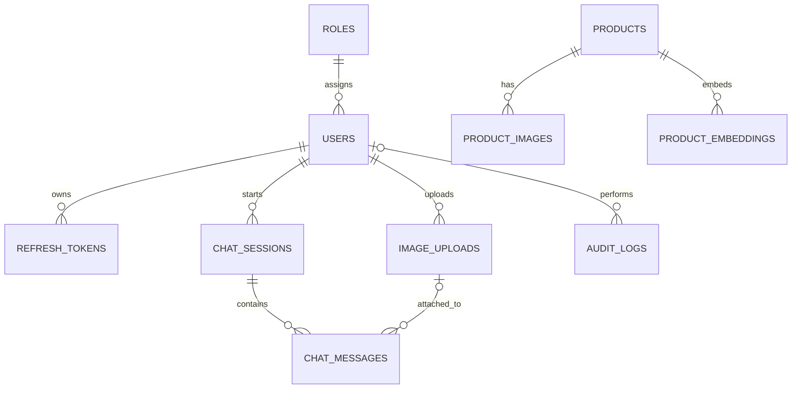

# Ink Buddy — Architecture, Database & API Design (Draft v2)

> สถานะ: ข้อเสนอเพื่อทบทวน ไม่ใช่ระบบที่พัฒนาเสร็จแล้ว  
> Business source of truth: [`../../BUSINESS_REQUIREMENTS.md`](../../BUSINESS_REQUIREMENTS.md)

## ขอบเขตที่ยืนยันแล้ว

Ink Buddy เป็นแชตบอตช่วยตอบเรื่องเครื่องเขียน ค้นหาและแนะนำสินค้าจาก catalog ผู้ใช้ **แนบได้เฉพาะรูปภาพ** เพื่อวิเคราะห์หรือหาสินค้าที่ตรง/คล้าย ไม่มีการอัปโหลด PDF/DOCX จากผู้ใช้ และไม่มีตาราง `documents`, `document_chunks`, `document_embeddings`

RAG ในเอกสารนี้หมายถึงการดึง **ข้อมูลสินค้าใน catalog** มาเป็นบริบทของคำตอบ ไม่ได้หมายถึงการค้นเอกสารที่ผู้ใช้อัปโหลด ข้อมูล catalog อาจนำเข้าจาก CSV, ฐานข้อมูล หรือระบบร้านค้าโดยกระบวนการหลังบ้านในอนาคต แต่แหล่งจริงยังต้องตัดสินใจ

**Stack:** Next.js, TypeScript, Tailwind CSS; FastAPI, LangChain, SQLAlchemy; PostgreSQL + pgvector; Ollama กับ Qwen3:8b, Qwen2.5-VL:7b, BGE-M3; JWT

---

## 1. Project Architecture

### Architecture Diagram

```text
┌───────────────────────────────────────────────────────┐
│ Next.js: Login · Chat · Product Search · Image Upload │
└──────────────────────────┬────────────────────────────┘
                           │ HTTPS
┌──────────────────────────▼────────────────────────────┐
│ FastAPI: Auth · Chat · Products · Vision · Admin       │
│ Validation · Authorization · Rate limit               │
└────────────┬──────────────────────┬───────────────────┘
             │                      │
┌────────────▼────────────┐ ┌───────▼───────────────────┐
│ Business services       │ │ AI services / LangChain   │
│ Catalog · Recommendations│ │ Catalog RAG · Vision · OCR │
│ Chat · Session summary  │ │ Ollama adapters           │
└────────────┬────────────┘ └───────┬───────────────────┘
             │                      │
┌────────────▼──────────────────┐ ┌─▼─────────────────────────┐
│ PostgreSQL + pgvector         │ │ Ollama                    │
│ Users · Products · Chats      │ │ Qwen3 · Qwen2.5-VL · BGE-M3│
│ Product embeddings · Images   │ └───────────────────────────┘
└───────────────────────────────┘
             │
┌────────────▼──────────────────┐
│ Private image storage         │
└───────────────────────────────┘
```

### Components และ Data Flow

| Component | หน้าที่ |
|---|---|
| Next.js | Login, chat, ค้น/ดูสินค้า, แนบรูป, แสดงผลและที่มาของข้อมูล |
| FastAPI | REST API, validation, JWT, authorization, response contract |
| Business services | กฎสินค้า, การจัดอันดับ/แนะนำ, ownership ของแชตและภาพ |
| `app/ai` | model adapters, embedding/retrieval, prompts, vision/OCR, summary |
| PostgreSQL | ผู้ใช้ สินค้า แชต ภาพ และ audit |
| pgvector | ค้นสินค้าเชิงความหมายจาก product embeddings |
| Ollama | รันโมเดลข้อความ ภาพ และ embedding ภายในระบบ |
| Private storage | เก็บภาพต้นฉบับโดยไม่เปิด path ตรง |

เส้นทางหลัก: ผู้ใช้ถาม/แนบรูป → FastAPI ตรวจตัวตนและข้อมูล → ค้น catalog ด้วย structured filters และ/หรือ vector similarity → โมเดลช่วยเรียบเรียงคำตอบจากสินค้าที่พบ → ส่งรายการสินค้าและแหล่งข้อมูล → บันทึกแชต

### Catalog RAG Workflow

```text
Catalog import/update → normalize product facts → BGE-M3 embedding
→ save products + product_embeddings

User question → parse intent/filters → structured + vector product search
→ retrieve candidate products → Qwen3 grounded response
→ validate product IDs/source references → answer + recommendations
```

ราคา สต็อก SKU และเงื่อนไขที่ต้องตรงเป๊ะให้ใช้ข้อมูลเชิงโครงสร้างก่อน semantic search ไม่ให้โมเดลเดาข้อมูลที่ catalog ไม่มี หากไม่มีสินค้าที่ตรง ให้บอกตามจริง

### Vision Workflow

```text
Image upload → validate/store privately → Qwen2.5-VL description/OCR
→ extract brand/model/color/shape candidates → catalog search
→ exact match only when independently verified; otherwise similar products
```

### Conversation Summary

เมื่อแชตยาวขึ้น ให้สรุปข้อความเก่าลง `chat_sessions.summary` พร้อม checkpoint ของข้อความที่สรุปแล้ว ใช้ summary เป็นบริบท ไม่ใช้เป็นหลักฐานข้อเท็จจริงสินค้า การสรุปอาจทำใน background job เพื่อไม่ให้คำตอบช้า

### Security Layer

- HTTPS, CORS allowlist, JWT, ตรวจ owner ของ session/image ทุกครั้ง
- Access token อายุสั้น; refresh token แบบหมุนเวียนและ revoke ได้
- ตรวจ MIME จากเนื้อหา ขนาด และ pixel count; เก็บภาพใน private storage
- Rate limit login/upload/inference; จำกัดขนาด prompt
- ถือว่าข้อความจากรูปและ catalog เป็น untrusted data; ไม่ให้เปลี่ยน system instructions
- ไม่สร้างราคา สต็อก SKU หรือคุณสมบัติที่ไม่มีใน catalog
- Audit เหตุการณ์สำคัญโดยไม่ log password/token

**Trade-off:** Ollama ภายในควบคุมข้อมูลได้ แต่ต้องจัดการ GPU/RAM, throughput และ monitoring เอง Production ควรแยก background worker สำหรับ embedding, image analysis และ summary เมื่อโหลดสูงขึ้น

---

## 2. Database Design

ใช้ UUID เป็น PK และ `timestamptz` สำหรับเวลา ชนิด `vector(N)` ต้องกำหนด `N` ตาม output ของ BGE-M3 รุ่นที่ติดตั้งจริงก่อน migration

### `roles` — บทบาท

| Column Name | Data Type | Nullable | Description |
|---|---|---|---|
| `id` | `uuid` | No | PK |
| `name` | `varchar(50)` | No | user/admin; unique |
| `description` | `text` | Yes | รายละเอียด |

PK `id`; unique index `name`; 1 role ต่อหลาย users

### `users` — บัญชีผู้ใช้

| Column Name | Data Type | Nullable | Description |
|---|---|---|---|
| `id` | `uuid` | No | PK |
| `role_id` | `uuid` | No | FK → `roles.id` |
| `email` | `varchar(320)` | No | อีเมล login |
| `password_hash` | `text` | No | hash เท่านั้น |
| `display_name` | `varchar(120)` | Yes | ชื่อแสดง |
| `is_active` | `boolean` | No | สถานะ |
| `created_at` | `timestamptz` | No | เวลาสร้าง |
| `updated_at` | `timestamptz` | No | เวลาแก้ไข |

PK `id`; FK `role_id`; unique email แบบ case insensitive; index `role_id`; 1 user ต่อหลาย sessions/images

### `refresh_tokens` — การต่ออายุ login

| Column Name | Data Type | Nullable | Description |
|---|---|---|---|
| `id` | `uuid` | No | PK |
| `user_id` | `uuid` | No | FK → `users.id` |
| `token_hash` | `text` | No | hash ของ refresh token |
| `expires_at` | `timestamptz` | No | วันหมดอายุ |
| `revoked_at` | `timestamptz` | Yes | เวลายกเลิก |
| `created_at` | `timestamptz` | No | เวลาสร้าง |

PK `id`; FK `user_id`; unique `token_hash`; index `(user_id, expires_at)`; 1 user ต่อหลาย tokens

### `chat_sessions` — บทสนทนา

| Column Name | Data Type | Nullable | Description |
|---|---|---|---|
| `id` | `uuid` | No | PK |
| `user_id` | `uuid` | No | FK → `users.id` |
| `title` | `varchar(200)` | Yes | ชื่อแชต |
| `summary` | `text` | Yes | สรุปบริบท |
| `summary_checkpoint` | `integer` | Yes | ลำดับข้อความล่าสุดที่สรุป |
| `created_at` | `timestamptz` | No | เวลาสร้าง |
| `updated_at` | `timestamptz` | No | กิจกรรมล่าสุด |
| `deleted_at` | `timestamptz` | Yes | soft delete |

PK `id`; FK `user_id`; index `(user_id, updated_at DESC)` เฉพาะแถวที่ยังไม่ลบ; 1 session ต่อหลาย messages

### `chat_messages` — ข้อความ

| Column Name | Data Type | Nullable | Description |
|---|---|---|---|
| `id` | `uuid` | No | PK |
| `session_id` | `uuid` | No | FK → `chat_sessions.id` |
| `sequence_number` | `integer` | No | ลำดับใน session |
| `role` | `varchar(20)` | No | user/assistant/system |
| `content` | `text` | No | ข้อความ |
| `product_refs` | `jsonb` | Yes | snapshot สินค้าที่แนะนำ |
| `image_id` | `uuid` | Yes | FK → `image_uploads.id` |
| `model_name` | `varchar(100)` | Yes | โมเดลที่ตอบ |
| `created_at` | `timestamptz` | No | เวลาสร้าง |

PK `id`; FKs `session_id`, `image_id`; unique `(session_id, sequence_number)`; index `(session_id, created_at, id)`. `product_refs` ควรเก็บ product ID และ source snapshot เพื่อแสดงประวัติเดิมได้แม้ catalog เปลี่ยน

### `products` — catalog เครื่องเขียน

| Column Name | Data Type | Nullable | Description |
|---|---|---|---|
| `id` | `uuid` | No | PK |
| `sku` | `varchar(100)` | Yes | รหัสสินค้า |
| `name` | `text` | No | ชื่อสินค้า |
| `category` | `varchar(100)` | Yes | ประเภท |
| `brand` | `varchar(100)` | Yes | ยี่ห้อ |
| `description` | `text` | Yes | รายละเอียดที่ตรวจสอบได้ |
| `attributes` | `jsonb` | No | สี ขนาด ชนิดหมึก ฯลฯ |
| `price` | `numeric(12,2)` | Yes | ราคาเมื่อมีข้อมูล |
| `currency` | `char(3)` | Yes | สกุลเงิน |
| `availability` | `varchar(30)` | Yes | สถานะจากแหล่งข้อมูล |
| `source_ref` | `text` | Yes | ที่มาข้อมูล |
| `created_at` | `timestamptz` | No | เวลาสร้าง |
| `updated_at` | `timestamptz` | No | เวลาปรับปรุง |

PK `id`; unique partial index `sku` เมื่อไม่เป็น null; indexes `category`, `brand`, ชื่อสินค้า; GIN `attributes` เมื่อมี filter จริง. 1 product ต่อหลาย images/embeddings

### `product_images` — ภาพสินค้าใน catalog

| Column Name | Data Type | Nullable | Description |
|---|---|---|---|
| `id` | `uuid` | No | PK |
| `product_id` | `uuid` | No | FK → `products.id` |
| `storage_key` | `text` | No | ที่เก็บภาพ |
| `is_primary` | `boolean` | No | ภาพหลัก |
| `alt_text` | `text` | Yes | คำอธิบาย |

PK `id`; FK/index `product_id`; partial unique `(product_id) WHERE is_primary`; 1 product ต่อหลาย images

### `product_embeddings` — เวกเตอร์สำหรับค้นสินค้า

| Column Name | Data Type | Nullable | Description |
|---|---|---|---|
| `id` | `uuid` | No | PK |
| `product_id` | `uuid` | No | FK → `products.id` |
| `model_name` | `varchar(100)` | No | embedding model/version |
| `source_text` | `text` | No | ข้อความสินค้าแบบ normalized ที่ฝังเป็นเวกเตอร์ |
| `embedding` | `vector(N)` | No | BGE-M3 embedding |
| `created_at` | `timestamptz` | No | เวลาสร้าง |

PK `id`; FK `product_id`; unique `(product_id, model_name)`; พิจารณา HNSW index เมื่อ catalog โตและผลทดสอบคุ้มค่า. เมื่อรายละเอียดสินค้าเปลี่ยนต้อง re-embed. เวกเตอร์จากภาพโดยตรงต้องใช้ image embedding model เพิ่ม; BGE-M3 text embedding เพียงอย่างเดียวไม่ใช่ image-to-image search

### `image_uploads` — ภาพที่ผู้ใช้แนบ

| Column Name | Data Type | Nullable | Description |
|---|---|---|---|
| `id` | `uuid` | No | PK |
| `user_id` | `uuid` | No | FK → `users.id` |
| `storage_key` | `text` | No | ที่เก็บภาพส่วนตัว |
| `mime_type` | `varchar(100)` | No | MIME ที่ตรวจพบ |
| `size_bytes` | `bigint` | No | ขนาด |
| `status` | `varchar(20)` | No | สถานะ |
| `ocr_text` | `text` | Yes | ข้อความ OCR |
| `analysis` | `jsonb` | Yes | ผลวิเคราะห์ภาพ |
| `created_at` | `timestamptz` | No | เวลาอัปโหลด |
| `deleted_at` | `timestamptz` | Yes | soft delete |

PK `id`; FK `user_id`; unique `storage_key`; index `(user_id, created_at DESC)`; 1 user ต่อหลาย images

### `audit_logs` — เหตุการณ์สำคัญ

| Column Name | Data Type | Nullable | Description |
|---|---|---|---|
| `id` | `uuid` | No | PK |
| `actor_user_id` | `uuid` | Yes | FK → `users.id`; null สำหรับระบบ |
| `action` | `varchar(100)` | No | เช่น login.failed |
| `resource_type` | `varchar(50)` | Yes | ประเภททรัพยากร |
| `resource_id` | `uuid` | Yes | ID ทรัพยากร |
| `metadata` | `jsonb` | No | ข้อมูลที่ไม่เป็นความลับ |
| `created_at` | `timestamptz` | No | เวลาเหตุการณ์ |

PK `id`; FK `actor_user_id`; indexes `(actor_user_id, created_at DESC)`, `(action, created_at DESC)`; กำหนด retention ก่อน production

### ER Diagram



**pgvector usage/trade-off:** ใช้ vector ของข้อความสินค้าค้นความหมายร่วมกับ structured filters. สำหรับ catalog เล็ก อาจเริ่มด้วย PostgreSQL text search และเพิ่ม pgvector เมื่อวัดผลว่าช่วยจริง. การค้นจากภาพใน MVP ใช้ vision model แปลงภาพเป็นคุณลักษณะ/ข้อความแล้วค้น catalog; หากต้องการ visual similarity ที่แม่นขึ้นในอนาคตต้องประเมิน image embedding model แยกต่างหาก

---

## 3. API Specification

### Conventions

- Base path `/api/v1`; JSON เป็น `snake_case`; IDs เป็น UUID; เวลา ISO 8601 พร้อม timezone
- รายการใช้ `limit`/`cursor`; `1 ≤ limit ≤ 100`
- Error shape: `{"error":{"code":"...","message":"...","details":{}}}`
- Common status: `401` unauthenticated, `403` forbidden, `404` not found, `422` validation, `429` rate limited, `503` dependency unavailable
- Protected endpoints ใช้ `Authorization: Bearer <access_token>`; upload ใช้ multipart
- ตัวอย่างย่อเฉพาะ field หลัก; implementation ควรใช้ Pydantic schemas/OpenAPI

### Authentication

#### Login

- **Purpose:** เข้าสู่ระบบ
- **Endpoint:** `/auth/login`
- **Method:** `POST`
- **Authentication Required:** No
- **Request Headers:** `Content-Type: application/json`
- **Path Parameters:** ไม่มี
- **Query Parameters:** ไม่มี
- **Request Body:** `{"email":"a@example.com","password":"..."}`
- **Success Response:** `200`; access token, user, refresh cookie
- **Error Responses:** `401 INVALID_CREDENTIALS`, `429 RATE_LIMITED`
- **Validation Rules:** email ถูกต้อง; password ไม่ว่าง
- **Business Rules:** บัญชีต้อง active
- **Security Considerations:** ไม่เปิดเผยว่า email มีอยู่ไหม; ไม่ log password
- **Example Request:** `POST /api/v1/auth/login` พร้อม body ข้างต้น
- **Example Response:** `{"access_token":"...","token_type":"bearer","expires_in":900,"user":{"id":"<uuid>","email":"a@example.com"}}`

#### Refresh Token

- **Purpose:** ต่ออายุ access token
- **Endpoint:** `/auth/refresh`
- **Method:** `POST`
- **Authentication Required:** refresh cookie
- **Request Headers:** `Cookie: refresh_token=...`
- **Path Parameters:** ไม่มี
- **Query Parameters:** ไม่มี
- **Request Body:** ไม่มี
- **Success Response:** `200`; access token และ rotated refresh cookie
- **Error Responses:** `401 INVALID_REFRESH_TOKEN`, `429 RATE_LIMITED`
- **Validation Rules:** token ยังไม่หมดอายุ/ถูกยกเลิก
- **Business Rules:** หมุนเวียน refresh token ทุกครั้ง
- **Security Considerations:** HttpOnly/Secure/SameSite; CSRF protection ตาม cookie policy
- **Example Request:** `POST /api/v1/auth/refresh`
- **Example Response:** `{"access_token":"...","token_type":"bearer","expires_in":900}`

#### Logout

- **Purpose:** ยกเลิก refresh token
- **Endpoint:** `/auth/logout`
- **Method:** `POST`
- **Authentication Required:** Yes
- **Request Headers:** Bearer token, refresh cookie
- **Path Parameters:** ไม่มี
- **Query Parameters:** ไม่มี
- **Request Body:** ไม่มี
- **Success Response:** `204 No Content`
- **Error Responses:** `401 UNAUTHORIZED`
- **Validation Rules:** token ถูกต้อง
- **Business Rules:** เรียกซ้ำได้โดยไม่มีผลเสีย
- **Security Considerations:** revoke token และล้าง cookie
- **Example Request:** `POST /api/v1/auth/logout`
- **Example Response:** ไม่มี body

#### Get Profile

- **Purpose:** อ่านโปรไฟล์ตนเอง
- **Endpoint:** `/auth/me`
- **Method:** `GET`
- **Authentication Required:** Yes
- **Request Headers:** Bearer token
- **Path Parameters:** ไม่มี
- **Query Parameters:** ไม่มี
- **Request Body:** ไม่มี
- **Success Response:** `200`; profile
- **Error Responses:** `401 UNAUTHORIZED`
- **Validation Rules:** ไม่มี
- **Business Rules:** ไม่ส่ง password hash
- **Security Considerations:** อ่านเฉพาะบัญชีปัจจุบัน
- **Example Request:** `GET /api/v1/auth/me`
- **Example Response:** `{"id":"<uuid>","email":"a@example.com","display_name":"Ann","role":"user"}`

### Chat

#### Create Chat Session

- **Purpose:** เริ่มบทสนทนา
- **Endpoint:** `/chat-sessions`
- **Method:** `POST`
- **Authentication Required:** Yes
- **Request Headers:** Bearer token, JSON
- **Path Parameters:** ไม่มี
- **Query Parameters:** ไม่มี
- **Request Body:** `{"title":"เลือกปากกา"}`; title ไม่บังคับ
- **Success Response:** `201`; session
- **Error Responses:** `401`, `422`
- **Validation Rules:** title ไม่เกิน 200 ตัวอักษร
- **Business Rules:** owner คือผู้ใช้ปัจจุบัน
- **Security Considerations:** ไม่รับ user_id จาก client
- **Example Request:** `POST /api/v1/chat-sessions`
- **Example Response:** `{"id":"<uuid>","title":"เลือกปากกา","created_at":"2026-09-30T10:00:00Z"}`

#### Get Chat Sessions

- **Purpose:** ดูประวัติแชต
- **Endpoint:** `/chat-sessions`
- **Method:** `GET`
- **Authentication Required:** Yes
- **Request Headers:** Bearer token
- **Path Parameters:** ไม่มี
- **Query Parameters:** `limit`, `cursor`
- **Request Body:** ไม่มี
- **Success Response:** `200`; items/next_cursor
- **Error Responses:** `401`, `422`
- **Validation Rules:** `1 ≤ limit ≤ 100`
- **Business Rules:** เรียงล่าสุดก่อน; ไม่รวมที่ลบ
- **Security Considerations:** กรอง owner
- **Example Request:** `GET /api/v1/chat-sessions?limit=20`
- **Example Response:** `{"items":[{"id":"<uuid>","title":"เลือกปากกา"}],"next_cursor":null}`

#### Get Chat Session Detail

- **Purpose:** ดู session และข้อความ
- **Endpoint:** `/chat-sessions/{session_id}`
- **Method:** `GET`
- **Authentication Required:** Yes
- **Request Headers:** Bearer token
- **Path Parameters:** `session_id: UUID`
- **Query Parameters:** `limit`, `cursor` สำหรับข้อความ
- **Request Body:** ไม่มี
- **Success Response:** `200`; session/messages/next_cursor
- **Error Responses:** `401`, `404`, `422`
- **Validation Rules:** UUID/pagination ถูกต้อง
- **Business Rules:** ส่ง product refs ที่บันทึกไว้
- **Security Considerations:** ตรวจ owner
- **Example Request:** `GET /api/v1/chat-sessions/<uuid>`
- **Example Response:** `{"id":"<uuid>","messages":[{"role":"user","content":"แนะนำปากกา"}],"next_cursor":null}`

#### Send Message

- **Purpose:** ถามเรื่องเครื่องเขียนหรือสินค้าในแชต
- **Endpoint:** `/chat-sessions/{session_id}/messages`
- **Method:** `POST`
- **Authentication Required:** Yes
- **Request Headers:** Bearer token, JSON
- **Path Parameters:** `session_id: UUID`
- **Query Parameters:** ไม่มี
- **Request Body:** `{"content":"แนะนำปากกาเจล","image_id":null}`
- **Success Response:** `201`; user/assistant messages, product refs
- **Error Responses:** `401`, `404`, `422`, `429`, `503 MODEL_UNAVAILABLE`
- **Validation Rules:** content ไม่ว่างหรือมี image_id; image เป็นของผู้ใช้
- **Business Rules:** ค้น catalog ก่อนตอบข้อเท็จจริง; summary อัปเดตเมื่อถึงเกณฑ์
- **Security Considerations:** จำกัด prompt size; ไม่ทำตามคำสั่งในภาพ/catalog
- **Example Request:** `POST /api/v1/chat-sessions/<uuid>/messages` body `{"content":"มีปากกาเขียนลื่นไหม"}`
- **Example Response:** `{"user_message":{"id":"<uuid>"},"assistant_message":{"id":"<uuid>","content":"พบสินค้าที่อาจเหมาะ...","product_refs":["<product_uuid>"]}}`

#### Delete Session

- **Purpose:** ลบแชต
- **Endpoint:** `/chat-sessions/{session_id}`
- **Method:** `DELETE`
- **Authentication Required:** Yes
- **Request Headers:** Bearer token
- **Path Parameters:** `session_id: UUID`
- **Query Parameters:** ไม่มี
- **Request Body:** ไม่มี
- **Success Response:** `204 No Content`
- **Error Responses:** `401`, `404`
- **Validation Rules:** UUID ถูกต้อง
- **Business Rules:** soft delete; retention รอกำหนด
- **Security Considerations:** ตรวจ owner
- **Example Request:** `DELETE /api/v1/chat-sessions/<uuid>`
- **Example Response:** ไม่มี body

### Products / Catalog RAG

#### Search Products

- **Purpose:** ค้นสินค้าแบบข้อความและตัวกรอง
- **Endpoint:** `/products`
- **Method:** `GET`
- **Authentication Required:** Yes
- **Request Headers:** Bearer token
- **Path Parameters:** ไม่มี
- **Query Parameters:** `q`, `category`, `brand`, `min_price`, `max_price`, `limit`, `cursor`
- **Request Body:** ไม่มี
- **Success Response:** `200`; products/next_cursor
- **Error Responses:** `401`, `422`, `503 SEARCH_UNAVAILABLE`
- **Validation Rules:** ราคาต้องไม่ติดลบ; min ≤ max; limit 1–100
- **Business Rules:** ตัวกรองที่ต้องตรงใช้ structured query; semantic score ช่วยจัดอันดับ
- **Security Considerations:** จำกัดความยาว q; parameterized queries
- **Example Request:** `GET /api/v1/products?q=ปากกาเจล&limit=10`
- **Example Response:** `{"items":[{"id":"<uuid>","name":"ปากกาเจล","price":null,"source_ref":"catalog"}],"next_cursor":null}`

#### Get Product Detail

- **Purpose:** ดูรายละเอียดสินค้าที่ตรวจสอบได้
- **Endpoint:** `/products/{product_id}`
- **Method:** `GET`
- **Authentication Required:** Yes
- **Request Headers:** Bearer token
- **Path Parameters:** `product_id: UUID`
- **Query Parameters:** ไม่มี
- **Request Body:** ไม่มี
- **Success Response:** `200`; product พร้อมรูปและ source
- **Error Responses:** `401`, `404`, `422`
- **Validation Rules:** UUID ถูกต้อง
- **Business Rules:** ราคา/สต็อกที่ไม่มีข้อมูลให้เป็น null ไม่เดา
- **Security Considerations:** ไม่เปิด storage key ภายใน
- **Example Request:** `GET /api/v1/products/<uuid>`
- **Example Response:** `{"id":"<uuid>","name":"ปากกาเจล","category":"pen","attributes":{"color":"blue"},"price":null}`

#### Recommend Products

- **Purpose:** แนะนำสินค้าโดยอิงความต้องการ
- **Endpoint:** `/product-recommendations`
- **Method:** `POST`
- **Authentication Required:** Yes
- **Request Headers:** Bearer token, JSON
- **Path Parameters:** ไม่มี
- **Query Parameters:** ไม่มี
- **Request Body:** `{"need":"ปากกาสำหรับจดทุกวัน","budget_max":200,"limit":5}`
- **Success Response:** `200`; products และเหตุผลแต่ละรายการ
- **Error Responses:** `401`, `422`, `503 MODEL_UNAVAILABLE`
- **Validation Rules:** need ไม่ว่าง; budget ไม่ติดลบ; limit จำกัด
- **Business Rules:** แนะนำเฉพาะสินค้าที่มีจริงใน catalog; บอกเมื่อไม่พบ
- **Security Considerations:** ตรวจ product IDs ก่อนส่ง; ไม่สร้างข้อมูลสินค้าเอง
- **Example Request:** `POST /api/v1/product-recommendations`
- **Example Response:** `{"items":[{"product_id":"<uuid>","reason":"เหมาะกับการจดต่อเนื่องจากข้อมูลสินค้า"}]}`

#### Search Products by Image

- **Purpose:** ค้นสินค้าในภาพที่แนบ
- **Endpoint:** `/product-search/by-image`
- **Method:** `POST`
- **Authentication Required:** Yes
- **Request Headers:** Bearer token, JSON
- **Path Parameters:** ไม่มี
- **Query Parameters:** ไม่มี
- **Request Body:** `{"image_id":"<uuid>","limit":5}`
- **Success Response:** `200`; image interpretation และ product matches
- **Error Responses:** `401`, `404`, `422`, `503 VISION_UNAVAILABLE`
- **Validation Rules:** image ID ถูกต้อง; limit จำกัด
- **Business Rules:** exact เฉพาะเมื่อ SKU/รุ่นยืนยันได้; มิฉะนั้น similar
- **Security Considerations:** ตรวจ owner ของภาพ; จำกัด inference
- **Example Request:** `POST /api/v1/product-search/by-image`
- **Example Response:** `{"description":"ปากกาสีน้ำเงิน","matches":[{"product_id":"<uuid>","match_type":"similar"}]}`

### Vision

#### Upload Image

- **Purpose:** แนบภาพ
- **Endpoint:** `/images`
- **Method:** `POST`
- **Authentication Required:** Yes
- **Request Headers:** Bearer token, multipart/form-data
- **Path Parameters:** ไม่มี
- **Query Parameters:** ไม่มี
- **Request Body:** field `file`
- **Success Response:** `201`; image ID
- **Error Responses:** `401`, `413`, `415`, `422`, `429`
- **Validation Rules:** ชนิด/ขนาด/pixel count ตาม config
- **Business Rules:** การแนบรูปยังไม่ยืนยันตัวสินค้า
- **Security Considerations:** private storage; ตรวจไฟล์จริง
- **Example Request:** `POST /api/v1/images` multipart `file=@pen.jpg`
- **Example Response:** `{"id":"<uuid>","status":"ready"}`

#### Analyze Image

- **Purpose:** อธิบายภาพและคุณลักษณะ
- **Endpoint:** `/images/{image_id}/analysis`
- **Method:** `POST`
- **Authentication Required:** Yes
- **Request Headers:** Bearer token, JSON
- **Path Parameters:** `image_id: UUID`
- **Query Parameters:** ไม่มี
- **Request Body:** `{}`
- **Success Response:** `200`; description/attributes
- **Error Responses:** `401`, `404`, `422`, `503 VISION_UNAVAILABLE`
- **Validation Rules:** ภาพพร้อมใช้งาน
- **Business Rules:** ผลเป็นการตีความ ไม่ใช่ข้อมูลยืนยันสินค้า
- **Security Considerations:** ตรวจ owner; ไม่ทำตามคำสั่งในภาพ
- **Example Request:** `POST /api/v1/images/<uuid>/analysis`
- **Example Response:** `{"description":"ปากกาลูกลื่นสีน้ำเงิน","attributes":{"color":"blue"}}`

#### OCR Image

- **Purpose:** อ่านข้อความในภาพ
- **Endpoint:** `/images/{image_id}/ocr`
- **Method:** `POST`
- **Authentication Required:** Yes
- **Request Headers:** Bearer token
- **Path Parameters:** `image_id: UUID`
- **Query Parameters:** ไม่มี
- **Request Body:** ไม่มี
- **Success Response:** `200`; text/segments
- **Error Responses:** `401`, `404`, `422`, `503 VISION_UNAVAILABLE`
- **Validation Rules:** ภาพพร้อมใช้งาน
- **Business Rules:** OCR เป็นผลประมาณ; ตรวจซ้ำก่อนอ้างรุ่น/SKU
- **Security Considerations:** ตรวจ owner; จำกัดการเรียกซ้ำ
- **Example Request:** `POST /api/v1/images/<uuid>/ocr`
- **Example Response:** `{"text":"INK 0.5 BLUE","segments":[{"text":"INK 0.5 BLUE"}]}`

### Admin

#### System Health Check

- **Purpose:** ตรวจสถานะพื้นฐาน
- **Endpoint:** `/health`
- **Method:** `GET`
- **Authentication Required:** No
- **Request Headers:** ไม่มี
- **Path Parameters:** ไม่มี
- **Query Parameters:** ไม่มี
- **Request Body:** ไม่มี
- **Success Response:** `200`; status
- **Error Responses:** `503 UNHEALTHY`
- **Validation Rules:** ไม่มี
- **Business Rules:** readiness แบบละเอียดแยก `/health/ready` ได้
- **Security Considerations:** ไม่เผยรายละเอียดภายใน
- **Example Request:** `GET /api/v1/health`
- **Example Response:** `{"status":"ok"}`

#### Model Status

- **Purpose:** ตรวจความพร้อมโมเดล
- **Endpoint:** `/admin/models/status`
- **Method:** `GET`
- **Authentication Required:** Yes, admin
- **Request Headers:** Bearer token
- **Path Parameters:** ไม่มี
- **Query Parameters:** ไม่มี
- **Request Body:** ไม่มี
- **Success Response:** `200`; text/vision/embedding status
- **Error Responses:** `401`, `403`, `503 OLLAMA_UNAVAILABLE`
- **Validation Rules:** ไม่มี
- **Business Rules:** ตรวจรุ่นจาก config
- **Security Considerations:** ไม่เผยข้อมูลเครื่องเกินจำเป็น
- **Example Request:** `GET /api/v1/admin/models/status`
- **Example Response:** `{"text":{"name":"qwen3:8b","ready":true},"vision":{"name":"qwen2.5-vl:7b","ready":true},"embedding":{"name":"bge-m3","ready":true}}`

---

## 4. Recommendations และเรื่องที่ยังต้องตัดสินใจ

1. เริ่มจาก catalog ที่มีข้อมูลจริง แล้วทำ text search + chat/product references ก่อน image search
2. สร้าง product embeddings เมื่อมีข้อมูลพอและวัดผลว่า semantic search ช่วยการค้นจริง
3. ให้ `services` ถือ business rules; LangChain เป็น adapter เพื่อเปลี่ยน orchestration ได้ภายหลัง
4. เพิ่ม background worker/queue สำหรับงาน inference หรือ embedding ที่ช้าเมื่อระบบโต
5. วาง interface สำหรับ tool calling/MCP/multi-agent ได้ แต่ยังไม่จำเป็นต้องสร้าง agent architecture ใน MVP

| Decision | ตัวเลือก/ผลกระทบ |
|---|---|
| Catalog source | CSV/import, database เดิม หรือร้านค้า API; กระทบการ sync และ source reference |
| ราคา/สต็อก | ไม่มี, import เป็นช่วง หรือ real-time; กระทบความน่าเชื่อถือของคำตอบ |
| Image match | similar เป็นหลัก หรือ exact เฉพาะยืนยัน SKU/รุ่น |
| การซื้อ | ค้น/แนะนำอย่างเดียว หรือเชื่อม checkout ภายหลัง |
| Retention | ระยะเก็บภาพ แชต และ audit; กระทบ soft delete/cleanup |

